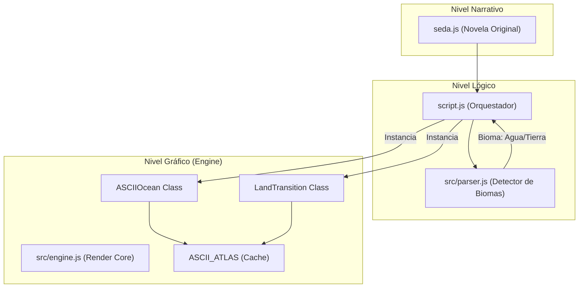
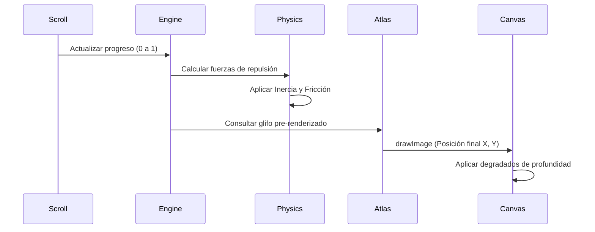

# Seda: Especificación Técnica del Motor

Este documento detalla la arquitectura técnica, los algoritmos de renderizado y el flujo de datos del motor narrativo "Seda". Su objetivo es servir como guía para el mantenimiento y la escalabilidad futura del proyecto.

---

## 1. Arquitectura del Sistema

El motor sigue un patrón de diseño desacoplado para separar la lógica de negocio (literatura) del núcleo gráfico (ASCII y 3D).

---

## 2. Los Módulos del Motor

### 2.1. `parser.js` (El Intérprete)
Es la única fuente de verdad sobre el terreno que se está recorriendo. Utiliza un sistema de **firmas textuales** para identificar pasajes de mar o tierra.
- **`firmasViaje`**: Diccionario de fragmentos de texto que disparan biomas específicos.
- **`analizarViaje(texto)`**: Retorna un objeto `{ tipo: 'agua' | 'tierra' | 'normal' }`.

### 2.2. `engine.js` (El Corazón Visual)
Contiene las clases encargadas de transformar el texto en píxeles interactivos.

#### 🌊 ASCIIOcean
Simula un océano 2D infinito de caracteres con físicas de repulsión.
- **Voronoi Noise**: Genera patrones de ondas orgánicas mediante una matriz pre-calculada.
- **Física de Repulsión**: El texto del "barco" (hilo narrativo) actúa como una zona de exclusión dinámica. Cada partícula ASCII calcula su distancia al casco y se desplaza proporcionalmente.
- **Optimización de Euler**: Las partículas usan integración de Euler (`px += vx`, `vx *= friction`) para un movimiento fluido y orgánico.

#### 🗺️ LandTransition
Gestor de las transiciones 3D cinemáticas hacia el horizonte.
- **Proyección de Perspectiva**: Mapea coordenadas 3D (X, Y, Z) a un Canvas 2D mediante escalado FOV (`700 / zFinal`).
- **Handover Procedure**: Sincroniza el punto exacto donde el texto 3D desaparece en el horizonte y el texto del DOM se vuelve visible, eliminando saltos visuales.
- **Single-Active Guard**: Asegura que solo la transición más cercana al centro de la pantalla consuma ciclos de CPU.

---

## 3. Pipeline de Renderizado ASCII

El flujo de procesamiento para cada frame sigue este camino crítico:

---

## 4. Estrategias de Rendimiento

Para mantener los 60fps estables, el motor implementa varias técnicas avanzadas:

1.  **`ASCII_ATLAS`**: En lugar de usar `fillText()` (muy lento), el motor dibuja todos los caracteres una sola vez en un canvas oculto y luego copia esos píxeles usando `drawImage()`. Es hasta 10 veces más rápido.
2.  **Culling de Filas**: Solo se procesan y renderizan las líneas ASCII que están dentro del viewport (el área visible) más un pequeño margen de seguridad.
3.  **DPI Throttling**: En dispositivos móviles de alta densidad (Retina, etc.), el motor limita la resolución del canvas interno para evitar procesar millones de píxeles innecesarios.
4.  **Short-Circuiting**: Si no hay salpicaduras activas o el barco no está sobre el agua, se omiten los bucles de cálculo de colisiones mediante verificaciones booleanas rápidas.

---

## 5. Mantenimiento del Código

- **Coordenadas**: El sistema usa el centro de la pantalla como `(0, 0, 0)` para proyecciones 3D.
- **Módulos ES**: Siempre utilizar `import`/`export`. El proyecto requiere un servidor local para cargar (no funciona vía `file://`).
- **Dependencias**: El motor depende de la librería externa `Pretext` para el cálculo de layouts tipográficos precisos antes del renderizado.
